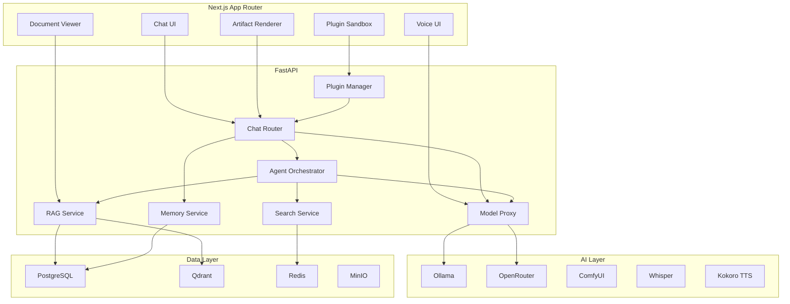

# DClaw Chat — Swarm Agent Build Prompt

> **App:** DClaw Chat  
> **Category:** Communication  
> **Current:** v0.2.0 scaffold (multi-model chat, persistent history, voice input)  
> **Target:** v1.0 production-ready  
> **Repo:** https://github.com/dclawstack/dclaw-chat  
> **Docs:** https://docs.dclawstack.io/apps/chat

---

## Your Mission

Transform DClaw Chat from its current v0.2.0 scaffold into a **production-grade v1.0 AI communication platform** that is:
- **Future-ready:** Agent-native architecture, multi-modal ready, extensible plugin system
- **AI-ready:** Deep Ollama integration, smart context management, autonomous agent delegation
- **Frictionless:** Zero-config local setup, conversational everything, predictive UI
- **Classy:** DKube design system, buttery animations, accessible, dark/light modes

Research competitors (ChatGPT, Claude, Perplexity, LibreChat, OpenWebUI). Do gap analysis. Design features. Write architecture. Produce the v1.0 spec.

---

## Current State

### What Works (v0.2.0)
- Multi-model chat UI (Ollama, OpenRouter, Claude, GPT-4)
- Persistent conversation history
- Voice input / speech-to-text
- Desktop app via Tauri v2
- End-to-end encrypted messaging
- Folder-based conversation organization
- PII Shield integration

### Stack
- **Frontend:** Next.js 14, Tailwind, shadcn/ui, Tauri v2
- **Backend:** FastAPI, SQLAlchemy 2.0, asyncpg, pydantic v2
- **AI:** Ollama (local), OpenRouter (cloud fallback)
- **DB:** PostgreSQL 16 (CloudNativePG)
- **Real-time:** Server-Sent Events for streaming
- **Auth:** Logto JWT

### Mock Endpoints (Current)
- `POST /conversations` — create conversation
- `GET /conversations/{id}/messages` — get messages
- `POST /conversations/{id}/messages` — send message (streams SSE)
- `GET /models` — list available models

---

## Competitor Analysis

### 1. ChatGPT (OpenAI)
- **Strengths:** Best-in-class reasoning, plugins, DALL-E, voice mode, memory
- **Weaknesses:** Cloud-only, no local models, $20/mo, data privacy concerns
- **Gap for DClaw:** Local-first, BYOK, open-source, white-label

### 2. Claude (Anthropic)
- **Strengths:** Long context (200K), document analysis, artifacts, coding
- **Weaknesses:** Cloud-only, $20/mo, no local option, limited integrations
- **Gap for DClaw:** Local document RAG, artifact system, enterprise deployment

### 3. Perplexity
- **Strengths:** Real-time search, citations, pro search
- **Weaknesses:** Cloud-only, search-dependent, limited model choice
- **Gap for DClaw:** Local search + RAG, multiple search providers, private search

### 4. LibreChat
- **Strengths:** Open source, multi-model, self-hosted, presets
- **Weaknesses:** Dated UI, no agents, limited mobile, no desktop
- **Gap for DClaw:** Modern UI, agent swarms, desktop app, DKube design

### 5. OpenWebUI
- **Strengths:** Open source, Ollama-native, self-hosted, pipelines
- **Weaknesses:** Basic UI, no advanced features, limited extensibility
- **Gap for DClaw:** Polished UX, agent framework, enterprise features, plugins

---

## Gap Analysis

| Feature | ChatGPT | Claude | Perplexity | LibreChat | OpenWebUI | DClaw Chat v0.2 | DClaw Chat v1.0 |
|---------|---------|--------|------------|-----------|-----------|-----------------|-----------------|
| Local LLMs | ❌ | ❌ | ❌ | ✅ | ✅ | ✅ | ✅ |
| Cloud Fallback | ✅ | ✅ | ✅ | ✅ | ❌ | ✅ | ✅ |
| Multi-Modal | ✅ | ✅ | ❌ | ❌ | ❌ | ❌ | ✅ |
| Agent Swarms | ❌ | ❌ | ❌ | ❌ | ❌ | ❌ | ✅ |
| Voice Mode | ✅ | ❌ | ❌ | ❌ | ❌ | ✅ | ✅ |
| Real-Time Search | ❌ | ❌ | ✅ | ❌ | ❌ | ❌ | ✅ |
| Document RAG | ✅ | ✅ | ✅ | ❌ | ❌ | ❌ | ✅ |
| Code Artifacts | ❌ | ✅ | ❌ | ❌ | ❌ | ❌ | ✅ |
| Plugin System | ✅ | ❌ | ❌ | ❌ | ❌ | ❌ | ✅ |
| White-Label | ❌ | ❌ | ❌ | ❌ | ❌ | ❌ | ✅ |
| E2E Encryption | ❌ | ❌ | ❌ | ❌ | ❌ | ✅ | ✅ |
| Desktop App | ✅ | ❌ | ❌ | ❌ | ❌ | ✅ | ✅ |
| PII Shield | ❌ | ❌ | ❌ | ❌ | ❌ | ✅ | ✅ |

**Key Differentiators for v1.0:**
1. **Agent Swarm** — Multiple AI agents collaborating in one conversation
2. **Multi-Modal Native** — Images, audio, video, documents as first-class citizens
3. **Local RAG** — Private document search with vector database
4. **Real-Time Search** — Brave Search + DuckDuckGo + custom connectors
5. **Code Artifacts** — Runnable code blocks, preview, execution
6. **Plugin Ecosystem** — Community plugins for tools, data sources, actions

---

## Feature Design (v1.0)

### P0 — Must Have

#### F1: Conversation Engine v2
- **Threading:** Branching conversations (like Claude artifacts)
- **Context Management:** Token-aware context window with smart truncation
- **System Prompts:** Per-conversation custom system prompts
- **Templates:** Save and reuse prompt templates
- **Forking:** Fork a conversation at any point

#### F2: Multi-Model Orchestration
- **Model Router:** Auto-select best model per task (coding → CodeLlama, creative → Mistral)
- **Ensemble Mode:** Multiple models answer simultaneously, user picks best
- **Model Comparison:** Side-by-side A/B testing of model responses
- **Custom Endpoints:** Add any OpenAI-compatible endpoint

#### F3: Document RAG (Local)
- **Ingestion:** PDF, Word, Markdown, CSV, images (OCR)
- **Chunking:** Semantic chunking with overlap
- **Vector DB:** Qdrant (local) or pgvector (PostgreSQL)
- **Citation:** Every claim linked to source document
- **Highlight:** Source text highlighted in original document

#### F4: Real-Time Search
- **Providers:** Brave Search API, DuckDuckGo, SearXNG (self-hosted)
- **Modes:** Quick search (top 3 results) vs Deep search (full synthesis)
- **Citations:** Inline citations with source links
- **Custom Sources:** Add company wiki, Notion, Confluence

#### F5: Code Artifacts
- **Languages:** Python, JavaScript, TypeScript, Rust, Go, SQL
- **Execution:** Local sandbox via Docker or Deno
- **Preview:** Live preview for HTML/React components
- **Diff:** Show changes between iterations
- **Export:** Copy, download, or save to project

### P1 — Differentiators

#### F6: Agent Swarm
- **Specialists:** CodeAgent, ResearchAgent, CreativeAgent, DataAgent
- **Delegation:** "@CodeAgent review this function"
- **Collaboration:** Agents debate and synthesize answers
- **Memory:** Shared long-term memory across agents

#### F7: Multi-Modal Input/Output
- **Images:** Upload → analyze → generate (FLUX via ComfyUI)
- **Audio:** Whisper transcription, Kokoro TTS, music generation
- **Video:** Script → storyboard → scene generation
- **Documents:** Native rendering with annotation

#### F8: Plugin System
- **Marketplace:** Browse and install plugins from DPanel
- **Types:** Tool plugins (calculator, search), Data plugins (Notion, GitHub), Action plugins (send email, create task)
- **SDK:** TypeScript + Python SDK for plugin development
- **Sandbox:** Plugins run in isolated Web Workers / containers

#### F9: Smart Memory
- **Facts:** AI extracts and stores key facts about user preferences
- **Projects:** Context scoped to projects (codebase, research topic)
- **Recall:** "What did we decide about X last week?"
- **Privacy:** User controls what is remembered, one-click erase

### P2 — Post-Launch

- **F10:** Collaborative chat (multiplayer cursors, shared threads)
- **F11:** Scheduled agents ("Check my email every morning at 9am")
- **F12:** Voice mode v2 (real-time conversation, interruption)
- **F13:** Mobile app (React Native, shares codebase with desktop)

---

## Architecture

### System Diagram



### Database Schema

```python
# models.py
from sqlalchemy import String, DateTime, ForeignKey, JSON, Integer, Text, Boolean, Enum
from sqlalchemy.orm import Mapped, mapped_column, relationship
from datetime import datetime
from uuid import uuid4
import enum

class MessageRole(str, enum.Enum):
    SYSTEM = "system"
    USER = "user"
    ASSISTANT = "assistant"
    TOOL = "tool"
    AGENT = "agent"

class ConversationStatus(str, enum.Enum):
    ACTIVE = "active"
    ARCHIVED = "archived"
    PINNED = "pinned"

class User(Base):
    __tablename__ = "users"
    id: Mapped[str] = mapped_column(String(36), primary_key=True, default=lambda: str(uuid4()))
    email: Mapped[str] = mapped_column(String(255), unique=True, index=True)
    name: Mapped[str] = mapped_column(String(255))
    avatar_url: Mapped[str | None] = mapped_column(String(512), nullable=True)
    preferences: Mapped[dict] = mapped_column(JSON, default=dict)
    created_at: Mapped[datetime] = mapped_column(DateTime, default=datetime.utcnow)
    updated_at: Mapped[datetime] = mapped_column(DateTime, default=datetime.utcnow, onupdate=datetime.utcnow)

    conversations: Mapped[list["Conversation"]] = relationship(back_populates="user")
    memories: Mapped[list["Memory"]] = relationship(back_populates="user")

class Conversation(Base):
    __tablename__ = "conversations"
    id: Mapped[str] = mapped_column(String(36), primary_key=True, default=lambda: str(uuid4()))
    user_id: Mapped[str] = mapped_column(ForeignKey("users.id"), index=True)
    title: Mapped[str | None] = mapped_column(String(255), nullable=True)
    status: Mapped[ConversationStatus] = mapped_column(Enum(ConversationStatus), default=ConversationStatus.ACTIVE)
    model_id: Mapped[str] = mapped_column(String(100), default="llama3.2")
    system_prompt: Mapped[str | None] = mapped_column(Text, nullable=True)
    temperature: Mapped[float] = mapped_column(default=0.7)
    context_window: Mapped[int] = mapped_column(default=4096)
    metadata: Mapped[dict] = mapped_column(JSON, default=dict)
    created_at: Mapped[datetime] = mapped_column(DateTime, default=datetime.utcnow)
    updated_at: Mapped[datetime] = mapped_column(DateTime, default=datetime.utcnow, onupdate=datetime.utcnow)
    parent_id: Mapped[str | None] = mapped_column(ForeignKey("conversations.id"), nullable=True)

    user: Mapped["User"] = relationship(back_populates="conversations")
    messages: Mapped[list["Message"]] = relationship(back_populates="conversation", order_by="Message.created_at")
    documents: Mapped[list["Document"]] = relationship(back_populates="conversation")
    artifacts: Mapped[list["Artifact"]] = relationship(back_populates="conversation")

class Message(Base):
    __tablename__ = "messages"
    id: Mapped[str] = mapped_column(String(36), primary_key=True, default=lambda: str(uuid4()))
    conversation_id: Mapped[str] = mapped_column(ForeignKey("conversations.id"), index=True)
    role: Mapped[MessageRole] = mapped_column(Enum(MessageRole))
    content: Mapped[str] = mapped_column(Text)
    content_type: Mapped[str] = mapped_column(String(50), default="text")  # text, image, audio, code, artifact
    model_id: Mapped[str | None] = mapped_column(String(100), nullable=True)
    token_count: Mapped[int | None] = mapped_column(Integer, nullable=True)
    metadata: Mapped[dict] = mapped_column(JSON, default=dict)
    citations: Mapped[list[dict] | None] = mapped_column(JSON, nullable=True)
    created_at: Mapped[datetime] = mapped_column(DateTime, default=datetime.utcnow)

    conversation: Mapped["Conversation"] = relationship(back_populates="messages")

class Document(Base):
    __tablename__ = "documents"
    id: Mapped[str] = mapped_column(String(36), primary_key=True, default=lambda: str(uuid4()))
    conversation_id: Mapped[str] = mapped_column(ForeignKey("conversations.id"), index=True)
    filename: Mapped[str] = mapped_column(String(255))
    file_type: Mapped[str] = mapped_column(String(50))
    file_size: Mapped[int] = mapped_column(Integer)
    storage_path: Mapped[str] = mapped_column(String(512))
    chunk_count: Mapped[int] = mapped_column(default=0)
    embedding_model: Mapped[str] = mapped_column(String(100), default="nomic-embed-text")
    metadata: Mapped[dict] = mapped_column(JSON, default=dict)
    created_at: Mapped[datetime] = mapped_column(DateTime, default=datetime.utcnow)

    conversation: Mapped["Conversation"] = relationship(back_populates="documents")

class Artifact(Base):
    __tablename__ = "artifacts"
    id: Mapped[str] = mapped_column(String(36), primary_key=True, default=lambda: str(uuid4()))
    conversation_id: Mapped[str] = mapped_column(ForeignKey("conversations.id"), index=True)
    message_id: Mapped[str] = mapped_column(ForeignKey("messages.id"), index=True)
    title: Mapped[str] = mapped_column(String(255))
    artifact_type: Mapped[str] = mapped_column(String(50))  # code, html, svg, react, markdown
    language: Mapped[str | None] = mapped_column(String(50), nullable=True)
    content: Mapped[str] = mapped_column(Text)
    version: Mapped[int] = mapped_column(default=1)
    is_executable: Mapped[bool] = mapped_column(Boolean, default=False)
    created_at: Mapped[datetime] = mapped_column(DateTime, default=datetime.utcnow)
    updated_at: Mapped[datetime] = mapped_column(DateTime, default=datetime.utcnow, onupdate=datetime.utcnow)

    conversation: Mapped["Conversation"] = relationship(back_populates="artifacts")

class Memory(Base):
    __tablename__ = "memories"
    id: Mapped[str] = mapped_column(String(36), primary_key=True, default=lambda: str(uuid4()))
    user_id: Mapped[str] = mapped_column(ForeignKey("users.id"), index=True)
    memory_type: Mapped[str] = mapped_column(String(50))  # preference, fact, project, agent
    key: Mapped[str] = mapped_column(String(255))
    value: Mapped[str] = mapped_column(Text)
    confidence: Mapped[float] = mapped_column(default=1.0)
    source_message_id: Mapped[str | None] = mapped_column(String(36), nullable=True)
    expires_at: Mapped[datetime | None] = mapped_column(DateTime, nullable=True)
    created_at: Mapped[datetime] = mapped_column(DateTime, default=datetime.utcnow)

    user: Mapped["User"] = relationship(back_populates="memories")
```

---

## Key Code Snippets

### 1. AI Chat Service (Core Business Logic)

```python
# services/chat.py
from typing import AsyncIterator
import httpx
from sqlalchemy.ext.asyncio import AsyncSession
from dclaw_chat.config import settings
from dclaw_chat.models import Message, MessageRole, Conversation
from dclaw_chat.services.shield import shield_service
from dclaw_chat.services.memory import memory_service
from dclaw_chat.services.rag import rag_service

class ChatService:
    def __init__(self, db: AsyncSession):
        self.db = db
        self.ollama_url = settings.OLLAMA_URL
        self.openrouter_key = settings.OPENROUTER_API_KEY

    async def stream_message(
        self,
        conversation_id: str,
        user_message: str,
        model_id: str = "llama3.2",
        use_rag: bool = False,
        use_search: bool = False,
    ) -> AsyncIterator[str]:
        """Stream an AI response with full context assembly."""

        # 1. Apply PII Shield
        safe_message = await shield_service.redact(user_message)

        # 2. Retrieve relevant memories
        memories = await memory_service.get_relevant_memories(
            conversation_id=conversation_id,
            query=safe_message,
            limit=5,
        )

        # 3. Retrieve RAG context if enabled
        rag_context = ""
        if use_rag:
            rag_results = await rag_service.search(
                conversation_id=conversation_id,
                query=safe_message,
                top_k=3,
            )
            rag_context = self._format_rag_results(rag_results)

        # 4. Retrieve web search context if enabled
        search_context = ""
        if use_search:
            search_results = await self._web_search(safe_message)
            search_context = self._format_search_results(search_results)

        # 5. Build system prompt
        conversation = await self._get_conversation(conversation_id)
        system_prompt = self._build_system_prompt(
            conversation=conversation,
            memories=memories,
            rag_context=rag_context,
            search_context=search_context,
        )

        # 6. Build message history (token-aware truncation)
        history = await self._build_history(conversation_id, max_tokens=3200)

        # 7. Stream from Ollama (local) or OpenRouter (cloud)
        if model_id.startswith("local/") or await self._is_ollama_model(model_id):
            async for chunk in self._stream_ollama(
                model=model_id.replace("local/", ""),
                system=system_prompt,
                messages=history + [{"role": "user", "content": safe_message}],
            ):
                yield chunk
        else:
            async for chunk in self._stream_openrouter(
                model=model_id,
                system=system_prompt,
                messages=history + [{"role": "user", "content": safe_message}],
            ):
                yield chunk

        # 8. Extract and store memories
        await memory_service.extract_and_store(
            conversation_id=conversation_id,
            user_message=user_message,
        )

    def _build_system_prompt(
        self,
        conversation: Conversation,
        memories: list[dict],
        rag_context: str,
        search_context: str,
    ) -> str:
        parts = [conversation.system_prompt or "You are a helpful AI assistant."]

        if memories:
            parts.append(f"\nUser preferences/context:\n" + "\n".join(
                f"- {m['key']}: {m['value']}" for m in memories
            ))

        if rag_context:
            parts.append(f"\nRelevant documents:\n{rag_context}")

        if search_context:
            parts.append(f"\nWeb search results:\n{search_context}")

        return "\n".join(parts)

    async def _stream_ollama(
        self,
        model: str,
        system: str,
        messages: list[dict],
    ) -> AsyncIterator[str]:
        async with httpx.AsyncClient() as client:
            async with client.stream(
                "POST",
                f"{self.ollama_url}/api/chat",
                json={
                    "model": model,
                    "messages": [{"role": "system", "content": system}] + messages,
                    "stream": True,
                    "options": {"temperature": 0.7},
                },
                timeout=300,
            ) as response:
                async for line in response.aiter_lines():
                    if line.strip():
                        import json
                        data = json.loads(line)
                        if "message" in data and "content" in data["message"]:
                            yield data["message"]["content"]

    async def _is_ollama_model(self, model_id: str) -> bool:
        """Check if model is available locally via Ollama."""
        try:
            async with httpx.AsyncClient() as client:
                resp = await client.get(f"{self.ollama_url}/api/tags", timeout=5)
                models = resp.json().get("models", [])
                return any(m["name"] == model_id for m in models)
        except Exception:
            return False

    async def _web_search(self, query: str) -> list[dict]:
        """Search the web using Brave Search API."""
        async with httpx.AsyncClient() as client:
            resp = await client.get(
                "https://api.search.brave.com/res/v1/web/search",
                headers={"X-Subscription-Token": settings.BRAVE_API_KEY},
                params={"q": query, "count": 5},
                timeout=30,
            )
            data = resp.json()
            return [
                {
                    "title": r.get("title"),
                    "url": r.get("url"),
                    "description": r.get("description"),
                }
                for r in data.get("web", {}).get("results", [])
            ]

    def _format_rag_results(self, results: list[dict]) -> str:
        return "\n\n".join(
            f"[Source: {r['document_name']}]\n{r['chunk_text']}"
            for r in results
        )

    def _format_search_results(self, results: list[dict]) -> str:
        return "\n\n".join(
            f"[{i+1}] {r['title']}\n{r['description']}\n{r['url']}"
            for i, r in enumerate(results)
        )
```

### 2. RAG Service (Document Search)

```python
# services/rag.py
from qdrant_client import AsyncQdrantClient
from qdrant_client.models import Distance, VectorParams, PointStruct
import httpx

class RAGService:
    def __init__(self):
        self.qdrant = AsyncQdrantClient(host="localhost", port=6333)
        self.embed_url = "http://localhost:11434/api/embeddings"
        self.embed_model = "nomic-embed-text"

    async def index_document(
        self,
        conversation_id: str,
        document_id: str,
        chunks: list[str],
    ) -> None:
        collection_name = f"conv_{conversation_id}"

        # Create collection if not exists
        try:
            await self.qdrant.create_collection(
                collection_name=collection_name,
                vectors_config=VectorParams(size=768, distance=Distance.COSINE),
            )
        except Exception:
            pass  # Already exists

        # Get embeddings for all chunks
        embeddings = await self._get_embeddings(chunks)

        # Upload to Qdrant
        points = [
            PointStruct(
                id=f"{document_id}_{i}",
                vector=emb,
                payload={
                    "document_id": document_id,
                    "chunk_index": i,
                    "chunk_text": chunk,
                    "conversation_id": conversation_id,
                },
            )
            for i, (chunk, emb) in enumerate(zip(chunks, embeddings))
        ]

        await self.qdrant.upsert(
            collection_name=collection_name,
            points=points,
        )

    async def search(
        self,
        conversation_id: str,
        query: str,
        top_k: int = 3,
    ) -> list[dict]:
        collection_name = f"conv_{conversation_id}"

        query_embedding = await self._get_embeddings([query])

        results = await self.qdrant.search(
            collection_name=collection_name,
            query_vector=query_embedding[0],
            limit=top_k,
            with_payload=True,
        )

        return [
            {
                "document_id": r.payload["document_id"],
                "chunk_index": r.payload["chunk_index"],
                "chunk_text": r.payload["chunk_text"],
                "score": r.score,
            }
            for r in results
        ]

    async def _get_embeddings(self, texts: list[str]) -> list[list[float]]:
        embeddings = []
        for text in texts:
            async with httpx.AsyncClient() as client:
                resp = await client.post(
                    self.embed_url,
                    json={"model": self.embed_model, "prompt": text},
                )
                embeddings.append(resp.json()["embedding"])
        return embeddings
```

### 3. Agent Orchestrator

```python
# services/agents.py
from typing import AsyncIterator
import json

class AgentOrcstrator:
    """Routes tasks to specialized agents and synthesizes responses."""

    AGENTS = {
        "code": {
            "system": "You are an expert software engineer. Write clean, well-documented code.",
            "models": ["codellama", "deepseek-coder", "qwen2.5-coder"],
        },
        "research": {
            "system": "You are a research analyst. Provide thorough, cited analysis.",
            "models": ["llama3.2", "mistral", "mixtral"],
        },
        "creative": {
            "system": "You are a creative writer. Be imaginative and engaging.",
            "models": ["llama3.2", "mistral"],
        },
        "data": {
            "system": "You are a data scientist. Analyze data rigorously.",
            "models": ["llama3.2", "qwen2.5"],
        },
    }

    async def delegate(
        self,
        conversation_id: str,
        message: str,
        agent_type: str | None = None,
    ) -> AsyncIterator[str]:
        """Delegate to a specific agent or auto-select."""

        if agent_type is None:
            agent_type = await self._classify_intent(message)

        agent = self.AGENTS.get(agent_type, self.AGENTS["research"])

        # Stream from the best available model for this agent
        model = await self._select_best_model(agent["models"])

        async for chunk in self._stream_agent(
            model=model,
            system=agent["system"],
            message=message,
        ):
            yield chunk

    async def _classify_intent(self, message: str) -> str:
        """Use a lightweight model to classify user intent."""
        # In production: use a small classifier model or regex patterns
        msg_lower = message.lower()
        if any(k in msg_lower for k in ["code", "function", "bug", "refactor", "python", "javascript"]):
            return "code"
        if any(k in msg_lower for k in ["analyze", "data", "chart", "statistics", "csv"]):
            return "data"
        if any(k in msg_lower for k in ["write", "story", "poem", "creative", "blog"]):
            return "creative"
        return "research"

    async def _select_best_model(self, candidates: list[str]) -> str:
        """Select the first available model from the candidate list."""
        for model in candidates:
            if await self._is_available(model):
                return model
        return candidates[0]  # Fallback

    async def _is_available(self, model: str) -> bool:
        # Check Ollama availability
        return True  # Simplified

    async def _stream_agent(
        self,
        model: str,
        system: str,
        message: str,
    ) -> AsyncIterator[str]:
        # Reuse chat service streaming
        from dclaw_chat.services.chat import ChatService
        service = ChatService(db=None)  # Inject properly in production
        async for chunk in service._stream_ollama(
            model=model,
            system=system,
            messages=[{"role": "user", "content": message}],
        ):
            yield chunk
```

### 4. Auth Middleware (Logto JWT)

```python
# middleware/auth.py
from fastapi import Request, HTTPException, Depends
from fastapi.security import HTTPBearer, HTTPAuthorizationCredentials
import httpx
from dclaw_chat.config import settings

security = HTTPBearer(auto_error=False)

async def get_current_user(
    credentials: HTTPAuthorizationCredentials | None = Depends(security),
) -> dict:
    if not credentials:
        raise HTTPException(status_code=401, detail="Missing authorization header")

    token = credentials.credentials

    async with httpx.AsyncClient() as client:
        resp = await client.get(
            f"{settings.LOGTO_URL}/oidc/me",
            headers={"Authorization": f"Bearer {token}"},
            timeout=10,
        )

    if resp.status_code != 200:
        raise HTTPException(status_code=401, detail="Invalid token")

    user = resp.json()
    return {
        "id": user["sub"],
        "email": user.get("email"),
        "name": user.get("name"),
        "roles": user.get("roles", []),
    }

async def require_role(required_role: str):
    async def checker(user: dict = Depends(get_current_user)) -> dict:
        if required_role not in user.get("roles", []):
            raise HTTPException(status_code=403, detail="Insufficient permissions")
        return user
    return checker
```

### 5. PII Shield Middleware

```python
# middleware/shield.py
from fastapi import Request
from starlette.middleware.base import BaseHTTPMiddleware
import re

class PIIShieldMiddleware(BaseHTTPMiddleware):
    """Redact PII from outgoing requests and restore on incoming responses."""

    PATTERNS = {
        "email": (r"\b[A-Za-z0-9._%+-]+@[A-Za-z0-9.-]+\.[A-Z|a-z]{2,}\b", "[EMAIL]"),
        "phone": (r"\b\d{3}[-.]?\d{3}[-.]?\d{4}\b", "[PHONE]"),
        "ssn": (r"\b\d{3}-\d{2}-\d{4}\b", "[SSN]"),
        "credit_card": (r"\b(?:\d[ -]*?){{13,16}}\b", "[CC]"),
    }

    def __init__(self, app):
        super().__init__(app)
        self.token_map: dict[str, str] = {}
        self.token_counter = 0

    async def dispatch(self, request: Request, call_next):
        # Redact request body if present
        if request.method in ("POST", "PUT", "PATCH"):
            body = await request.body()
            if body:
                redacted_body = self._redact(body.decode())
                # Replace body (simplified — use proper request manipulation)
                request._body = redacted_body.encode()

        response = await call_next(request)

        # Restore response body if present
        # In production: intercept response stream and restore tokens

        return response

    def _redact(self, text: str) -> str:
        for pii_type, (pattern, replacement) in self.PATTERNS.items():
            for match in re.finditer(pattern, text):
                original = match.group()
                self.token_counter += 1
                token = f"[{pii_type.upper()}_{self.token_counter}]"
                self.token_map[token] = original
                text = text.replace(original, token, 1)
        return text

    def _restore(self, text: str) -> str:
        for token, original in self.token_map.items():
            text = text.replace(token, original)
        return text
```

---

## Design System Application (DKube)

### Color Mapping

| Token | Value | Usage in Chat |
|-------|-------|---------------|
| `--dk-purple` | `#3B82F6` | Primary actions, user message bubbles, send button |
| `--dk-purple-light` | `#60A5FA` | Hover states, AI typing indicator |
| `--dk-purple-deep` | `#1D4ED8` | Pressed states, active model selector |
| `--dk-purple-wash` | `#EFF6FF` | Sidebar background, message input area |
| `--dk-ink` | `#0E0E10` | Display headings, "DClaw Chat" logo |
| `--dk-body` | `#1F1F23` | Message text |
| `--dk-muted` | `#6E6E76` | Timestamps, model names, secondary info |
| `--dk-surface` | `#FFFFFF` | Main chat background |
| `--dk-surface-2` | `#FAF9FC` | AI message bubbles |
| `--dk-surface-inverse` | `#111013` | Dark mode background |

### Component Specs

#### Message Bubble
```
- Padding: 16px 20px
- Border-radius: 20px (user), 12px (AI)
- Max-width: 80%
- Shadow: dk-shadow-sm
- Animation: fade-in 200ms + slide-up 100ms
```

#### Model Selector
```
- Height: 36px
- Padding: 0 14px
- Border-radius: dk-radius-full
- Border: 1px solid dk-hairline
- Background: dk-surface
- Active: dk-purple border + dk-purple-wash bg
```

#### Code Block
```
- Border-radius: dk-radius-lg
- Background: #1E1E2E (Catppuccin Mocha base)
- Padding: 16px
- Language badge: top-right, dk-text-xs, dk-purple-wash bg
- Copy button: hover reveal, top-right
```

---

## Testing Strategy

### Test Coverage Targets

| Layer | Target | Framework |
|-------|--------|-----------|
| Unit | 85% | pytest |
| Integration | 75% | pytest + httpx + TestClient |
| E2E | Critical paths | Playwright |
| Contract | 100% | schemathesis |
| Load | 100 concurrent | locust |

### Critical Test Cases

```python
# tests/test_chat_service.py

async def test_stream_message_with_ollama():
    """Given a user message, service should stream tokens from Ollama."""
    service = ChatService(db=mock_db)
    chunks = []
    async for chunk in service.stream_message(
        conversation_id="test-conv",
        user_message="Hello",
        model_id="llama3.2",
    ):
        chunks.append(chunk)
    assert len(chunks) > 0
    assert "".join(chunks) != ""

async def test_pii_redaction_before_api_call():
    """PII should be redacted before sending to OpenRouter."""
    service = ChatService(db=mock_db)
    with patch("httpx.AsyncClient.post") as mock_post:
        async for _ in service.stream_message(
            conversation_id="test-conv",
            user_message="My email is john@example.com",
            model_id="gpt-4",
        ):
            pass

        call_args = mock_post.call_args
        sent_messages = call_args.kwargs["json"]["messages"]
        assert "john@example.com" not in str(sent_messages)
        assert "[EMAIL_1]" in str(sent_messages)

async def test_rag_injection_in_system_prompt():
    """When RAG is enabled, relevant chunks should appear in system prompt."""
    service = ChatService(db=mock_db)
    with patch.object(service, "_stream_ollama") as mock_stream:
        mock_stream.return_value = async_iter(["Hello"])

        async for _ in service.stream_message(
            conversation_id="test-conv",
            user_message="What about the budget?",
            model_id="llama3.2",
            use_rag=True,
        ):
            pass

        call_args = mock_stream.call_args
        system = call_args.kwargs["system"]
        assert "Relevant documents:" in system

async def test_agent_auto_classification():
    """Code-related messages should route to CodeAgent."""
    orchestrator = AgentOrcstrator()
    agent_type = await orchestrator._classify_intent("Write a Python function to sort a list")
    assert agent_type == "code"

async def test_conversation_forking():
    """Forking a conversation should copy all messages up to fork point."""
    original = await create_conversation(messages=5)
    fork = await fork_conversation(original.id, message_index=3)

    assert fork.parent_id == original.id
    assert len(fork.messages) == 3
    assert fork.messages[2].content == original.messages[2].content
```

---

## Roadmap

### v1.0 — Launch (Jun 2026)
- [ ] F1: Conversation Engine v2 (threading, context, templates, forking)
- [ ] F2: Multi-Model Orchestration (router, ensemble, comparison)
- [ ] F3: Document RAG (ingestion, chunking, Qdrant, citations)
- [ ] F4: Real-Time Search (Brave, DDG, custom sources)
- [ ] F5: Code Artifacts (execution, preview, diff, export)
- [ ] DKube design system applied
- [ ] Test coverage > 80%
- [ ] Desktop app (Tauri) signed

### v1.1 — Agent Swarm (Jul 2026)
- [ ] F6: Agent Swarm (specialists, delegation, collaboration)
- [ ] F9: Smart Memory (facts, projects, recall)
- [ ] Plugin SDK alpha
- [ ] Mobile-responsive chat UI

### v1.2 — Multi-Modal (Aug 2026)
- [ ] F7: Multi-Modal (images, audio, video, documents)
- [ ] F8: Plugin Marketplace
- [ ] Voice Mode v2 (real-time, interruption)
- [ ] Collaborative chat (multiplayer)

### v2.0 — Platform (Q1 2027)
- [ ] F10: Collaborative chat v2
- [ ] F11: Scheduled agents
- [ ] F12: Mobile app (React Native)
- [ ] Enterprise features (SSO, audit, compliance)
- [ ] White-label builds

---

## Appendix: Updated API Spec

```yaml
openapi: 3.0.3
info:
  title: DClaw Chat API
  version: 1.0.0
paths:
  /api/v1/conversations:
    get:
      summary: List conversations
      parameters:
        - name: status
          in: query
          schema: { type: string, enum: [active, archived, pinned] }
        - name: search
          in: query
          schema: { type: string }
      responses:
        "200":
          content:
            application/json:
              schema:
                type: object
                properties:
                  conversations:
                    type: array
                    items:
                      type: object
                      properties:
                        id: { type: string }
                        title: { type: string }
                        status: { type: string }
                        model_id: { type: string }
                        message_count: { type: integer }
                        last_message_at: { type: string, format: date-time }
    post:
      summary: Create conversation
      requestBody:
        content:
          application/json:
            schema:
              type: object
              properties:
                title: { type: string }
                model_id: { type: string, default: "llama3.2" }
                system_prompt: { type: string }
      responses:
        "201":
          content:
            application/json:
              schema:
                type: object
                properties:
                  id: { type: string }
                  title: { type: string }

  /api/v1/conversations/{conversation_id}/messages:
    get:
      summary: Get messages
      parameters:
        - name: conversation_id
          in: path
          required: true
          schema: { type: string }
        - name: before_id
          in: query
          schema: { type: string }
        - name: limit
          in: query
          schema: { type: integer, default: 50 }
      responses:
        "200":
          content:
            application/json:
              schema:
                type: object
                properties:
                  messages:
                    type: array
                    items:
                      type: object
                      properties:
                        id: { type: string }
                        role: { type: string }
                        content: { type: string }
                        content_type: { type: string }
                        model_id: { type: string }
                        citations: { type: array }
                        created_at: { type: string, format: date-time }

    post:
      summary: Send message (streams SSE)
      parameters:
        - name: conversation_id
          in: path
          required: true
          schema: { type: string }
      requestBody:
        content:
          application/json:
            schema:
              type: object
              properties:
                content: { type: string }
                model_id: { type: string }
                use_rag: { type: boolean, default: false }
                use_search: { type: boolean, default: false }
                agent_type: { type: string }
      responses:
        "200":
          content:
            text/event-stream:
              schema:
                type: string

  /api/v1/conversations/{conversation_id}/fork:
    post:
      summary: Fork conversation at a message
      parameters:
        - name: conversation_id
          in: path
          required: true
          schema: { type: string }
      requestBody:
        content:
          application/json:
            schema:
              type: object
              properties:
                message_id: { type: string }
      responses:
        "201":
          content:
            application/json:
              schema:
                type: object
                properties:
                  id: { type: string }
                  parent_id: { type: string }

  /api/v1/conversations/{conversation_id}/documents:
    post:
      summary: Upload document for RAG
      parameters:
        - name: conversation_id
          in: path
          required: true
          schema: { type: string }
      requestBody:
        content:
          multipart/form-data:
            schema:
              type: object
              properties:
                file: { type: string, format: binary }
      responses:
        "201":
          content:
            application/json:
              schema:
                type: object
                properties:
                  id: { type: string }
                  filename: { type: string }
                  chunk_count: { type: integer }

  /api/v1/models:
    get:
      summary: List available models
      responses:
        "200":
          content:
            application/json:
              schema:
                type: object
                properties:
                  models:
                    type: array
                    items:
                      type: object
                      properties:
                        id: { type: string }
                        name: { type: string }
                        provider: { type: string }
                        context_length: { type: integer }
                        capabilities: { type: array, items: { type: string } }
                        is_local: { type: boolean }
```

---

## How to Use This Spec

1. **Review** the spec with stakeholders
2. **Prioritize** features based on team capacity
3. **Create** GitHub issues for each P0 feature
4. **Branch** per feature: `feat/chat/conversation-engine-v2`
5. **Implement** following DClaw conventions
6. **Test** with pytest + Playwright
7. **Document** updates in `docs/`
8. **Deploy** via Helm to staging → production

This document is a living spec. Update it as requirements evolve.
